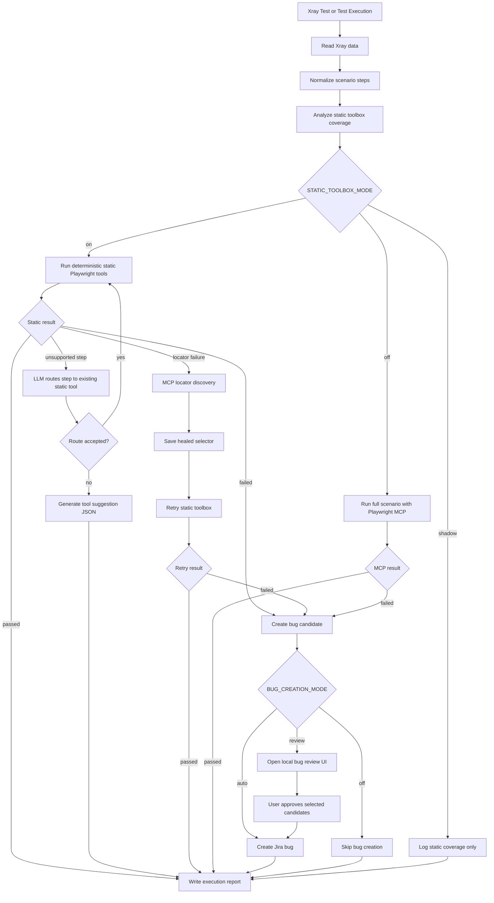

# AI Agent Hybrid Automation Framework

This project runs web test scenarios from Xray with a static-first hybrid automation architecture. The main idea is simple: deterministic static tools run the test first, while the LLM is used only at controlled points such as tool routing, tool suggestions, and locator self-healing.

The current project scope is web automation only.

## Architecture



```text
Xray Test or Test Execution
-> Read and normalize test steps
-> Match steps to the static web toolbox
-> Run static Playwright tools
   -> passed: finish without full MCP execution
   -> unsupported: ask the LLM router to map the step to an existing tool
      -> passed: finish without full MCP execution
      -> still unsupported: generate a tool suggestion JSON
   -> locator failure: run MCP locator discovery
      -> write the healed selector to locator JSON
      -> retry the static toolbox once
      -> still failed: create a bug candidate for manual review
```

Core principles:

- The static toolbox is the primary execution path.
- The LLM can route unclear steps to existing static tools.
- MCP is used for locator discovery when a static locator fails.
- In `off` mode, the full scenario runs with Playwright MCP.
- In `shadow` mode, only static coverage analysis runs; no browser execution is started.
- Unresolved failures can create Jira bug candidates for manual approval.

## Repository Map

- `Web_Aut/playwright_xray.py`: Runs one Xray Test issue.
- `Web_Aut/playwright_xray_execution.py`: Runs all tests inside an Xray Test Execution.
- `Web_Aut/playwright_xray_runner.py`: CLI helper that prompts for an execution key.
- `Web_Aut/mcp_full_scenario_executor.py`: Runs a full scenario with Playwright MCP.
- `Static_Aut/toolbox/static_toolbox.py`: Maps Xray steps to generic static web tools.
- `Static_Aut/execution/web_executors.py`: Playwright implementations of static web tools.
- `Static_Aut/routing/tool_router.py`: Uses the LLM to route unsupported steps to existing tools.
- `Static_Aut/routing/tool_suggester.py`: Generates tool suggestion files for unsupported steps.
- `Static_Aut/healing/self_healer.py`: MCP-backed locator discovery and self-healing.
- `Jira_Aut/xray_client.py`: Reads Xray Test and Test Execution data.
- `Jira_Aut/jira_bug_client.py`: Creates Jira bug issues.
- `Bug_Review/review_server.py`: Opens the local approval UI for bug candidates.
- `Resources/config.py`: Loads `.env` configuration.
- `Workbenchs/mcpConfig.py`: Configures the Playwright MCP workbench.

## Setup

### Prerequisites

Install these tools before running the project:

- Python 3.11 or newer
- Git
- A Jira/Xray instance or Xray Cloud credentials
- An OpenAI or Google API key, depending on the selected `LLM_MODEL_NAME`

The project is designed to run from a local virtual environment. Do not install the dependencies globally unless you intentionally manage Python that way.

### Windows PowerShell

From the repository root:

```powershell
cd C:\path\to\ai-agent-hybrid-architecture
python -m venv .venv
.\.venv\Scripts\Activate.ps1
python -m pip install --upgrade pip
python -m pip install -r requirements_win_os.txt
python -m playwright install chromium
```

If PowerShell blocks virtual environment activation, run this once for the current terminal session and activate again:

```powershell
Set-ExecutionPolicy -Scope Process -ExecutionPolicy Bypass
.\.venv\Scripts\Activate.ps1
```

### macOS

From the repository root:

```zsh
cd /path/to/ai-agent-hybrid-architecture
python3 -m venv .venv
source .venv/bin/activate
python -m pip install --upgrade pip
python -m pip install -r requirements_macos.txt
python -m playwright install chromium
```

### Configure Environment Variables

Create your local `.env` file from the example file:

```powershell
Copy-Item .env.example .env
```

On macOS/Linux:

```zsh
cp .env.example .env
```

Then open `.env` and fill in the values for your Jira/Xray and LLM provider. Keep `.env` local only; it is intentionally ignored by Git.

For a first local run, these are the main values to review:

```text
OPENAI_API_KEY=
GOOGLE_API_KEY=
LLM_MODEL_NAME=
XRAY_DEPLOYMENT=
JIRA_DATACENTER_URL=
JIRA_DATACENTER_API_TOKEN=
JIRA_CLOUD_URL=
JIRA_CLOUD_EMAIL=
JIRA_CLOUD_API_TOKEN=
XRAY_CLOUD_CLIENT_ID=
XRAY_CLOUD_CLIENT_SECRET=
BUG_PROJECT_KEY=
BUG_ISSUE_TYPE_ID=
STATIC_TOOLBOX_MODE=on
```

Use `XRAY_DEPLOYMENT=datacenter` for Jira/Xray Data Center and `XRAY_DEPLOYMENT=cloud` for Jira/Xray Cloud.

### Start The GUI

After the virtual environment is active and `.env` is configured, start the desktop runner:

```powershell
python GUI/gui_runner.py
```

On macOS/Linux, use the same command after activating `.venv`:

```zsh
python GUI/gui_runner.py
```

The GUI lets you configure the run type, Xray keys, Jira/Xray connection mode, LLM model, static toolbox mode, and bug creation mode from one screen.

## Environment Variables

Core Xray/Jira/LLM variables:

```text
OPENAI_API_KEY
LLM_MODEL_NAME
GOOGLE_API_KEY
XRAY_DEPLOYMENT
JIRA_DATACENTER_URL
JIRA_DATACENTER_API_TOKEN
JIRA_DATACENTER_VERIFY_SSL
JIRA_CLOUD_URL
JIRA_CLOUD_EMAIL
JIRA_CLOUD_API_TOKEN
XRAY_CLOUD_API_URL
XRAY_CLOUD_CLIENT_ID
XRAY_CLOUD_CLIENT_SECRET
BUG_PROJECT_KEY
BUG_ISSUE_TYPE_ID
BUG_TYPE_FIELD_ID
BUG_TYPE_OPTION_ID
BUG_CREATION_MODE
BUG_REVIEW_UI_AUTO_OPEN
```

`LLM_MODEL_NAME` must be one of the aliases defined in `LLMs/modelClient.py`, for example `gpt_4o`, `gpt_4o_mini`, `gpt_4_1`, `gpt_4_1_mini`, or `gemini_2_5_flash`.

Static toolbox variables:

```text
STATIC_TOOLBOX_MODE=on
STATIC_PLAYWRIGHT_HEADLESS=false
STATIC_SELF_HEALING_ENABLED=true
STATIC_LLM_ROUTER_ENABLED=true
STATIC_TOOL_SUGGESTIONS_ENABLED=true
STATIC_DEFAULT_APP_NAME=greenkart
STATIC_HEALING_MAX_RETRIES=3
STATIC_HEALING_HTML_LIMIT=4000
```

`STATIC_TOOLBOX_MODE` modes:

- `off`: Skip static execution and run the full scenario with Playwright MCP.
- `shadow`: Analyze static tool coverage and log the result only. No browser execution is started.
- `on`: Run the static toolbox as the main execution path.

| Variable | Values | Description |
| --- | --- | --- |
| `STATIC_TOOLBOX_MODE` | `off`, `shadow`, `on` | Selects the execution mode. |
| `STATIC_PLAYWRIGHT_HEADLESS` | `true`, `false` | Controls whether static Playwright runs headless. |
| `STATIC_SELF_HEALING_ENABLED` | `true`, `false` | Enables MCP locator healing after locator failures. |
| `STATIC_LLM_ROUTER_ENABLED` | `true`, `false` | Enables LLM routing for unsupported static steps. |
| `STATIC_TOOL_SUGGESTIONS_ENABLED` | `true`, `false` | Enables suggestion file generation for unsupported steps. |
| `STATIC_DEFAULT_APP_NAME` | profile name | Required app profile name from `Static_Aut/profiles/definitions/*.json`. |
| `STATIC_HEALING_MAX_RETRIES` | positive integer | Retry count for temporary MCP/LLM healing failures. |
| `STATIC_HEALING_HTML_LIMIT` | positive integer | Limits the failed page HTML excerpt sent to healing. |

Recommended mode for the current web hybrid flow:

```text
STATIC_TOOLBOX_MODE=on
```

## Running

### Recommended: Run From The GUI

Start the GUI from the repository root with the virtual environment active:

```powershell
.\.venv\Scripts\Activate.ps1
python GUI/gui_runner.py
```

The GUI supports two run types:

- `Test Execution`: runs every test inside an Xray Test Execution.
- `Single Test`: runs one Xray Test issue directly.

Typical GUI flow:

1. Select the Xray deployment type: `Data Center` or `Cloud`.
2. Fill in the Xray Test Execution key or Single Test key.
3. Choose the LLM model or keep the `.env` default.
4. Select `STATIC_TOOLBOX_MODE`.
5. Select the bug creation mode: `review`, `auto`, or `off`.
6. Start the run.

For regular usage, this is the recommended configuration:

```text
STATIC_TOOLBOX_MODE=on
BUG_CREATION_MODE=review
BUG_REVIEW_UI_AUTO_OPEN=true
```

When `BUG_CREATION_MODE=review`, unresolved failures are queued as bug candidates. After the run finishes, the local review page opens automatically if candidates exist. Select the candidates you want and use `Create selected bugs` from that browser page.

### Run A Single Xray Test From CLI

```powershell
.\.venv\Scripts\Activate.ps1
python Web_Aut/playwright_xray.py --test-key PROJ-345
```

### Run An Xray Test Execution From CLI

```powershell
.\.venv\Scripts\Activate.ps1
python Web_Aut/playwright_xray_execution.py --execution-key PROJ-333 --execution_mode web
```

### Use The CLI Prompt Runner

```powershell
.\.venv\Scripts\Activate.ps1
python Web_Aut/playwright_xray_runner.py
```

### Reports And Logs

Execution reports are written under:

```text
logs/execution_reports/
```

Each run writes an HTML report and a JSON sidecar with structured execution data. The report shows each test result, unsupported action or Expected Result gaps, whether a tool suggestion file was generated, whether MCP locator healing started, and whether a Jira bug was created.

Expected log shape for a successful static run:

```text
Static toolbox result | status=passed
Static toolbox execution passed. MCP full scenario execution is skipped.
Step 3: Scenario passed via static toolbox. No bug issue was created.
```

Expected log shape when locator self-healing starts:

```text
Static locator failure details | tool=... | locator_key=...
Step 1.5: Starting MCP locator discovery for locator_key=...
MCP locator discovery applied patch | locator_key=... | selector=...
Static toolbox retry after MCP locator repair | status=...
```

## Static Toolbox

The static toolbox maps Xray steps to generic deterministic web tools. Step matching lives in `Static_Aut/toolbox/static_toolbox.py`; Playwright execution lives in `Static_Aut/execution/web_executors.py`.

The toolbox is page-agnostic. Tool names describe browser primitives, not a specific application flow.

Navigation currently uses Playwright's `page.goto` inside `Static_Aut/execution/web_executors.py`. For slow internal environments, the navigation timeout can be tested statically in `_navigate_to_url`:

```python
await page.goto(url, wait_until="domcontentloaded", timeout=90_000)
```

The timeout value is in milliseconds. For example, `90_000` means 90 seconds.

Current generic web tools:

- `navigate_to_url`
- `reload_page`
- `go_back`
- `go_forward`
- `wait_for_page_load`
- `wait_for_element`
- `wait_for_text`
- `wait`
- `click_element`
- `double_click_element`
- `right_click_element`
- `hover_element`
- `focus_element`
- `fill_input`
- `clear_input`
- `type_text`
- `press_key`
- `check_checkbox`
- `uncheck_checkbox`
- `select_option`
- `upload_file`
- `scroll_page`
- `scroll_until_end`
- `scroll_to_element`
- `drag_and_drop`
- `find_text`
- `assert_text_visible`
- `assert_text_not_visible`
- `assert_image_visible`
- `assert_image_not_visible`
- `assert_element_visible`
- `assert_element_hidden`
- `assert_checkbox_checked`
- `assert_checkbox_unchecked`
- `assert_dropdown_selected`
- `assert_url_contains`
- `assert_title_contains`
- `assert_input_value`
- `get_text`
- `get_attribute`
- `get_input_value`
- `count_elements`
- `accept_dialog`
- `dismiss_dialog`
- `take_screenshot`

Application-specific tools such as `open_cart` or `add_to_cart` should not be added to the generic toolbox. Scenario-specific behavior should be expressed by composing generic web actions.

Suggested migration workflow:

1. Run a few real Xray tests with `STATIC_TOOLBOX_MODE=shadow`.
2. Inspect `logs/automation.log` to see which steps are covered.
3. Add only page-agnostic tools when a behavior is missing.
4. Once a scenario has full static coverage, switch to `STATIC_TOOLBOX_MODE=on`.

## LLM Static Router

`Static_Aut/routing/tool_router.py` maps unsupported steps only to existing static tools. It does not generate code and does not execute the test by itself.

Example:

```text
Unsupported step: Press the Login button
LLM route: click_element

Unsupported step: Verify that Welcome is displayed
LLM route: assert_text_visible
```

If the route is accepted, the static toolbox retries the same scenario with the generated tool overrides.

## Locator Self-Healing

When a static locator fails, MCP can inspect the live page and propose a better selector. The healed selector is saved under `Static_Aut/locators/healed_locators.json`, then the static toolbox is retried.

Example failure:

```text
failed_tool=click_element
locator_key=click_element__login
tried_selectors=...
```

Self-healing is locator-focused. It is not intended to let MCP freely rewrite the static flow.

## Tool Suggestions

If a step cannot be handled by the current toolbox and the LLM router cannot map it safely, a suggestion file can be generated:

```text
Static_Aut/routing/tool_suggestions/<test_key>_tool_suggestions.json
```

Suggested workflow:

1. Review the suggestion file.
2. Decide whether the behavior requires a truly generic web tool.
3. Add the tool to `Static_Aut/toolbox/static_toolbox.py` and `Static_Aut/execution/web_executors.py` only if it is generally useful.
4. Run the test again.

## Jira Bug Creation

If static execution fails and locator healing cannot resolve the issue, the framework can either create a Jira bug immediately or queue a review candidate first.

Required bug config:

```text
BUG_PROJECT_KEY
BUG_ISSUE_TYPE_ID
BUG_CREATION_MODE
```

`BUG_ISSUE_TYPE_ID` is Jira-instance specific. It must be the numeric issue type ID for the issue type you want the automation to create, usually `Bug`; do not assume the same value works across different Jira instances or projects.

`BUG_CREATION_MODE` values:

- `review`: default. Do not create Jira issues during test execution. Instead, queue bug candidates and open the local review UI after the report is written.
- `auto`: keep the previous behavior and create Jira bugs immediately.
- `off`: never create Jira bugs or bug candidates.

Optional custom bug type field config:

```text
BUG_TYPE_FIELD_ID
BUG_TYPE_OPTION_ID
```

`BUG_TYPE_FIELD_ID` and `BUG_TYPE_OPTION_ID` are only sent to Jira when both are configured. Created bugs are linked back to the Xray test with the Jira issue link type `Relates`.

If you want the browser review UI to open automatically when candidates exist, keep:

```text
BUG_REVIEW_UI_AUTO_OPEN=true
```

`BUG_TYPE_FIELD_ID` is the Jira REST API id of an optional custom field, such as `customfield_11953`. Use this when your Jira bug screen requires a field like `Bug Type`, `Defect Type`, or `Category`. Do not put the visible field name here.

`BUG_TYPE_OPTION_ID` is the Jira option id to select for that custom field, such as `11502`. For example:

```text
BUG_TYPE_FIELD_ID="customfield_11953"
BUG_TYPE_OPTION_ID="11502"
```

If your Jira project does not require this custom field, leave both values empty:

```text
BUG_TYPE_FIELD_ID=""
BUG_TYPE_OPTION_ID=""
```

## Xray Scenario Writing Guide

Write Xray steps as explicit browser actions. The static executor works best when the target UI text, label, field name, option, or expected value is quoted.

Quoted targets are safer because the parser can extract the exact intended UI text instead of guessing from the surrounding sentence. For example, `Click "Login" button` lets the executor target `Login` directly, while `Click login` requires heuristic cleanup and can be less reliable.

General rules:

- Use quoted targets: `Click "Login" button`, not `Click login`.
- Keep one main action per step. If a step needs a wait, write it as a separate line or separate Xray step.
- Use `Expected Result` for assertions, not for extra actions.
- If an Xray row has an empty `Action`, the row is skipped. Expected Results are validated only when they belong to an executable Action step.
- If `Expected Result` is empty, no assertion is generated for that step.
- `Wait` is treated as its own step, but it does not borrow input or dropdown context from previous steps. Expected Results after waits must be explicit.
- Put navigations in `Action` steps and URL checks in `Expected Result`. For example, `Navigate to "https://example.com/login"` opens the page, while `Expected Result: URL contains "https://example.com/login"` verifies the current browser URL.
- Prefer observable assertions: visible text, visible element, URL contains, title contains, input value, checkbox state, dropdown selected value.
- Avoid vague outcomes such as `The page is correct`, `The dropdown list is selected`, or `User successfully continues`.
- Avoid ambiguous state-only assertions such as `"Turkey" is selected`. State assertions must name the target control, such as `Dropdown "Country" selected value is "Turkey"`.
- Do not intentionally misspell UI text. Locator healing is for broken locators, not for correcting test data.

Recommended action patterns:

| Scenario type | Recommended step pattern |
| --- | --- |
| Navigate | `Navigate to "https://example.com"` |
| Wait fixed time | `Wait "2" seconds` |
| Click button/link/text | `Click "Login" button` or `Click "About"` |
| Fill input | `Fill "E-mail" field with "test@email.com"` |
| Clear input | `Clear "Search" field` |
| Press keyboard key | `Press "Enter"` |
| Check checkbox | `Check "checkbox 1" checkbox` |
| Uncheck checkbox | `Uncheck "checkbox 2" checkbox` |
| Select dropdown option | `Select "Option 1" from "Please select an option" dropdown` |
| Upload file | `Upload file "C:\path\file.txt"` |
| Scroll page | `Scroll down` or `Scroll to "Submit" button` |
| Hover | `Hover over "Products" menu` |

Recommended Expected Result patterns:

| Assertion type | Recommended Expected Result pattern |
| --- | --- |
| Text visible | `"Welcome" text is visible` |
| Text not visible | `"Error" text is not visible` |
| Element visible | `"Login" button is visible` |
| Multiple elements visible | `"Home", "About", "Contact Us" buttons are visible` |
| Checkbox checked | `Checkbox "checkbox 1" is checked` |
| Checkbox unchecked | `Checkbox "checkbox 2" is unchecked` |
| Dropdown selected | `Dropdown "Please select an option" selected value is "Option 1"` |
| URL assertion | `URL contains "/dashboard"` |
| Title assertion | `Title contains "Dashboard"` |
| Input value | `"E-mail" input value is "test@email.com"` |
| Image/logo visible | `"Company Logo" image is visible` |
| Table required columns populated | `Tablodaki her satırda "TailNumber", "Flight Number", "Departure" ve "Destination" kolonları dolu olmalıdır.` |
| Table column contains value | `Tablodaki "Start Date" kolonunun tüm hücreleri "Today" değerini içermelidir.` |

The table population assertion dynamically selects the first visible ARIA grid, ARIA
table, or HTML table and logs which table was selected. It checks the current page and
continues through visible, enabled next-page controls when pagination is available. No
application-specific table or pagination locator is required. The English form is:
`In every row of the table, the "TailNumber", "Flight Number", "Departure", and "Destination" columns must be populated.`
Empty text, `-`, `–`, `—`, `N/A`, `NA`, `null`, and `none` are treated as empty values.

The table column value assertion checks the selected column on every pagination page:
`All cells in the "Start Date" column must contain "Today".` Dynamic values such as
`Today`, `Bugün`, and `Bugun` use the execution date in `dd.MM.yyyy` format.

Input examples:

```text
Fill the "E-mail" field with "test@email.com".
Expected Result: "E-mail" input value is "test@email.com".
```

```text
Write "test@email.com" into "E-mail" text box.
Expected Result: "test@email.com" is entered into "E-mail" text box.
```

For input steps, keep both the field name and the value quoted. The static parser derives the field from the step text; do not rely on hard-coded field names such as username, password, or email.

Date inputs can use dynamic placeholders. `Fill "From" field with "Today"` resolves to the execution-day date in `dd.mm.yyyy` format, for example `12.06.2026`.

Dropdown example:

```text
Select "Option 1" from "Please select an option" dropdown
Expected Result: Dropdown "Please select an option" selected value is "Option 1"
```

Checkbox example:

```text
Uncheck "checkbox 2" checkbox
Expected Result: Checkbox "checkbox 2" is unchecked

Check "checkbox 1" checkbox
Checkbox "checkbox 1" is checked

```

Multiple expectations in one step are supported. Put each assertion on its own line when possible:

```text
Expected Result:
"Dashboard" text is visible.
"Home", "Reports", "Settings" buttons are visible.
URL contains "/dashboard"
```

Avoid these patterns:

| Avoid | Use instead |
| --- | --- |
| `The dropdown list is selected` | `Dropdown "Please select an option" selected value is "Option 1"` |
| `"Option 1" is selected` | `Dropdown "Please select an option" selected value is "Option 1"` |
| `The user logs in successfully` | `"Welcome" text is visible` or `URL contains "/dashboard"` |
| `Check option 1 is selected` | `Dropdown "Please select an option" selected value is "Option 1"` |
| `Verify buttons are visible` | `"Home", "About", "Contact Us" buttons are visible` |
| `Click the button` | `Click "Login" button` |

## Notes

- Do not commit `.env`.
- `.env.example` should contain only variable names and dummy values.
- The project is currently web-only.
- The static toolbox is the preferred path for repeatable automation.
- MCP and LLM support are helper layers, not the default replacement for deterministic execution.
